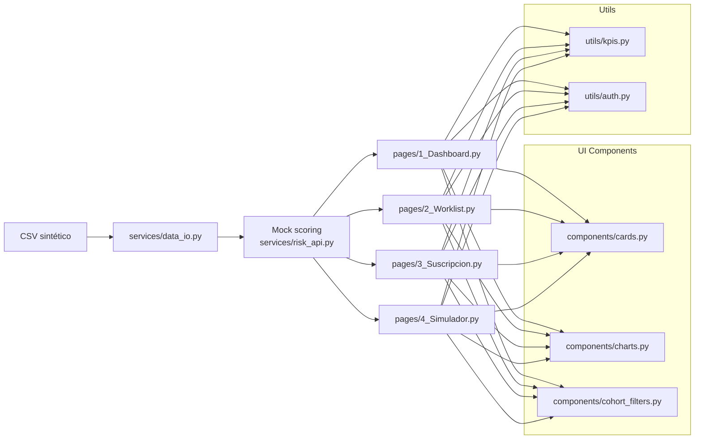

# CorpusAI — Interfaz Piloto para Aseguradoras (EPS/SGMM)

Versión propuesta de la **interfaz de usuario** para aseguradoras que trabajan con modelos de **riesgo de enfermedades crónicas y eventos cardiovasculares/renales**.
Este repo monta **cuatro aproximaciones** de UI en **Streamlit** usando **datos sintéticos (dummy)** para explorar la experiencia de usuario antes de conectar el backend/API real.

> ⚠️ **Importante**: No usa datos reales ni PHI. Todo es sintético y reproducible.
> 🇨🇴/🇲🇽 El selector **País/Modelo** alterna KPIs y lenguaje para **EPS (Colombia)** y **SGMM (México)**.

---

## 🧭 Estructura del proyecto

```
streamlit-corpus-insurers/
├─ Home.py
├─ pages/
│  ├─ 1_Dashboard.py         # Opción 1: Dashboard ejecutivo (población & riesgo)
│  ├─ 2_Worklist.py          # Opción 2: Worklist operativa (gestión de casos)
│  ├─ 3_Suscripcion.py       # Opción 3: Suscripción & tarificación (cotizador SGMM)
│  └─ 4_Simulador.py         # Opción 4: Simulador financiero (ROI / ΔPMPM / Loss Ratio)
├─ components/
│  ├─ cards.py               # Métricas/KPI cards
│  ├─ charts.py              # Gráficos Altair reutilizables
│  └─ cohort_filters.py      # Constructor de cohortes (filtros)
├─ services/
│  ├─ data_io.py             # Generación de población dummy
│  └─ risk_api.py            # Mock de scoring + explicabilidad (sin backend real)
├─ utils/
│  ├─ auth.py                # Selector País/Rol (mock)
│  └─ kpis.py                # Cálculo de KPIs y ROI simple
├─ .streamlit/
│  └─ config.toml            # Tema visual (oscuro) y ajustes de servidor
└─ requirements.txt
```

---

## 🧪 Qué incluye cada página

1. **Dashboard Ejecutivo — Población & Riesgo**

   * KPIs altos (Población, % Alto riesgo, PMPM o Loss Ratio simulado, % HTA control).
   * Filtros/cohortes, histograma de riesgo, “heat” por región, curvas por decil (12 meses).
   * Tabla resumen de la cohorte.

2. **Worklist Operativa — Gestión de Casos**

   * Bandeja priorizada por **proximidad temporal** y **riesgo**.
   * Tabla editable con “siguiente acción” y notas + **bitácora** (log) persistente en sesión.

3. **Suscripción & Tarificación (SGMM)**

   * Formulario clínico mínimo → **score** y **rango temporal** (mock).
   * **Prima sugerida** simulada con sliders de deducible/coaseguro y **gráfico de sensibilidad**.
   * Explicabilidad (top features dummy).

4. **Simulador Financiero — ROI/ΔPMPM/Loss Ratio**

   * Escenarios de intervención sobre la cohorte activa (reducción de hazard).
   * Estima **eventos evitados**, **ahorro**, **ROI** y compara **Base vs Escenario**.

---

## ⚙️ Requisitos

* **Python** 3.10–3.12 (recomendado 3.11).
* Librerías (pinneadas en `requirements.txt`):

  ```
  streamlit==1.39.0
  pandas==2.2.2
  numpy==2.1.1
  altair==5.3.0
  plotly==5.24.1
  pyarrow==17.0.0
  ```

---

## 🚀 Ejecución local

```bash
# 1) Clonar el repo
git clone https://github.com/<tu-org>/streamlit-corpus-insurers.git
cd streamlit-corpus-insurers

# 2) Crear y activar entorno
python -m venv .venv
# macOS/Linux:
source .venv/bin/activate
# Windows (PowerShell):
# .venv\Scripts\Activate.ps1

# 3) Instalar dependencias
pip install -r requirements.txt

# 4) Ejecutar la app multipágina
streamlit run Home.py
```

Abre el navegador en la URL que muestra la terminal (usualmente `http://localhost:8501`).

---

## ☁️ Despliegue en Streamlit Community Cloud

1. Sube este repo a **GitHub** (rama `main`).
2. Ve a **Streamlit → New app** y conecta tu cuenta de GitHub.
3. Selecciona repo y archivo principal: `Home.py`.
4. Deja **secrets** vacíos (no hay variables sensibles en este piloto).
5. Deploy. La app mostrará en la barra lateral el selector **País/Rol** y las **páginas**.

> Si editas el tema o parámetros de servidor, ajusta `.streamlit/config.toml`.

---

## 🔒 Privacidad y alcance

* **No** se usan datos reales. `services/data_io.py` genera **datos sintéticos** con semilla fija.
* **No** hay conexión a API externa; `services/risk_api.py` implementa un **mock** determinístico:

  * `risk_factor` (0–0.6 aprox.), `time_window_months` (1–6 o 6–12) y una **curva** de riesgo acumulado.
  * “Top features” y “care gaps” **simulados** para explorar UI/UX.
* Este proyecto es un **piloto de interacción** y **no** está destinado a uso clínico real.

---

## 🧑‍💼 Personas y flujos cubiertos

* **Director Médico / VP Salud** (EPS) / **Director de Siniestros** (SGMM):
  Panorama de riesgo, cohortes prioritarias, métricas de desempeño poblacional.
* **Gestor/a de Casos / Auditor**:
  Lista priorizada, acciones rápidas, registro y seguimiento (bitácora).
* **Actuario/Suscriptor**:
  Formulario mínimo, score, prima sugerida simulada y sensibilidad.
* **Planeación/CFO**:
  Simulador financiero para cuantificar impacto de programas.

---

## 📊 KPIs ejemplificados

* **EPS (Colombia)**: % alto riesgo, **PMPM** simulado, **Siniestralidad UPC** simulada, % HTA control.
* **SGMM (México)**: % alto riesgo, **Loss Ratio** simulado, severidad promedio, eventos esperados 12m.
* **Operación**: tasa de contacto <72h (simulada), cierre de brechas, eventos evitados (estimado).
* **Finanzas**: ahorro neto y **ROI** del escenario.

---

## 🧩 Arquitectura (alto nivel)



---

## 🛠️ Personalización rápida

* **Tamaño de población dummy**: cambia `n=` en cada página (función `get_scored_population`).
* **Reglas de scoring**: ajusta el modelo sintético en `services/risk_api.py::score_row`.
* **KPIs**: modifica `utils/kpis.py` para fórmulas EPS/SGMM.
* **Tema**: `.streamlit/config.toml`.
* **Gráficas**: `components/charts.py` (Altair).

---

## 🧯 Troubleshooting

* **Carga lenta/timeout** en Streamlit Cloud: reduce `n` (p. ej. 2500 → 1200).
* **Altair “maxRows”**: usamos agregaciones; si cargas dataframes muy grandes en gráficos, considera muestrear.
* **Módulos no encontrados**: verifica `pip install -r requirements.txt` en el entorno correcto.

---

## 📌 Roadmap sugerido

* Conectar `risk_api.py` al **backend real** con `requests` y manejo de errores.
* **Pseudonimización**/enmascaramiento reforzado si hay datos reales.
* **Autenticación** real por rol/tenancy.
* Métricas operativas (SLA, productividad) y descargas **CSV/PDF**.
* Validación con usuarios y pruebas A/B entre las 4 opciones.

---

## 📜 Licencia

Uso interno para pilotos de UX en Corpus AI. No redistribuir sin autorización.

---

## 🤝 Contribuir

1. Crea una rama feature: `git checkout -b feat/nombre-feature`
2. Asegura estilo/legibilidad y mensajes de commit claros.
3. PR contra `main` con descripción del cambio y captura de pantalla (si aplica).

---

## ✅ Estado

MVP de interacción **completo** con datos sintéticos y cuatro aproximaciones de interfaz listas para demo en **Streamlit Cloud**.

